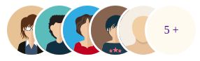

  
  

# React Multi Inline Images

<a href="https://www.npmjs.com/package/@keyvaluesystems/react-multi-inline-images"></a> <a href="https://www.npmjs.com/package/@keyvaluesystems/react-multi-inline-images" ></a> <a href="https://github.com/KeyValueSoftwareSystems/react-multi-inline-images"></a>

<div align="center">

</div>

 
>A customizable ready to use Multiple Inline Image stack for React

<!-- Try tweaking a dot matrix using this codesandbox link <a href="https://codesandbox.io/s/dot-matrix-chart-hqw9z0" >here</a> -->

## Installation

The easiest way to use react-multi-inline-images is to install it from npm and build it into your app with Webpack.

```bash
npm install @keyvaluesystems/react-multi-inline-images
```

You’ll need to install React separately since it isn't included in the package.

  

## Usage

React Multi Inline Images can run in a very basic mode by just providing the `data` like given below:

```jsx

import InlineImages from '@keyvaluesystems/react-multi-inline-images';

<InlineImages
  data={dataArray}
/>

```

The data is an array of objects with the following keys:

-  `name` - a string that represents each user's name
-  `avatarUrl` - a string to specify the user image


An example for data array is shown below:

```jsx
const dataArray = [
  {
    name: 'User 1',
    avatarUrl: 'example.svg'
  },
  {
    name: 'User 2'
  }
];

```

If no avatarUrl is specified for the user, following default Image will be considered.

<div align="center">

</div>

You can specify whether to add an elivation effect or to show name on hover with the help of 'elivateOnHover' and 'nameOnHover' prop. Even if elivateOnHover is true, the effect will only be there if the corresponding user has name specified in the data object.

```jsx
<InlineImages
  data={dataArray}
  elivateOnHover={true}
  nameOnHover={true}
/>
```

We can also control the distance between each user image with the help of spaceBetweenPics prop as follows.

```jsx
<InlineImages
  data={dataArray}
  spaceBetweenPics={30}
/>
```
## Props

  

Props that can be passed to the component are listed below:

<table>
  <thead>
    <tr>
      <th>Prop</th>
      <th>Description</th>
      <th>Default</th>
    </tr>
  </thead>
  <tbody>
    <tr>
      <td><code><b>data:</b> object[]</code></td>
      <td>
      An array of user objects to specify the name and avatar url (image url)
      </td>
      <td><code>undefined</code></td>
    </tr>
    <tr>
      <td><code><b>totalUserCount?:</b> number</code></td>
      <td>
      To specify the total number of users present if the additional count is to be displayed at the end of the image stack. The additional count displayed will be the difference between this value and length of data array
      </td>
      <td><code>0</code></td>
    </tr>
    <tr>
      <td><code><b>elivateOnHover?:</b> boolean</code></td>
      <td>
      To add an elivation effect on hover action for user images
      </td>
      <td><code>false</code></td>
    </tr>
    <tr>
      <td><code><b>nameOnHover?:</b> boolean</code></td>
      <td>
        To show the name of each user on hovering over the user image
      </td>
      <td><code>false</code></td>
    </tr>
    <tr>
      <td><code><b>onUserClick?:</b> function</code></td>
      <td>
        A callback function to be triggered on image click
      </td>
      <td><code>undefined</code></td>
    </tr>
    <tr>
      <td><code><b>spaceBetweenPics?:</b> number</code></td>
      <td>
        To specify the distance between each avatar (user image)
      </td>
      <td><code>20px</code></td>
    </tr>
  </tbody>
</table>


## Style Customizations

All the default styles provided by this package are overridable using the `styles` prop.
the below code shows all the overridable styles:

```jsx
<InlineImages
  data={dataArray}
  styles={{
    Avatar: () => ({...styles}),
    Name: () => ({...styles}),
    ExtraValue: () => ({...styles})
  }}
/>

```

-  `Avatar` - overrides the avatar (user image) style
-  `Name` - overrides the user name style
-  `ExtraValue` - overrides the style of additional value displayed at last